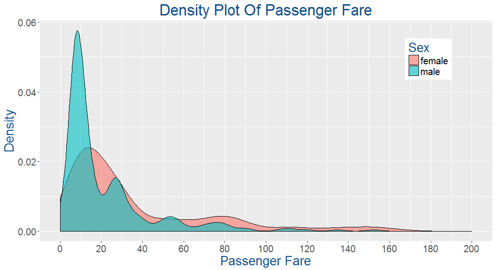

# Exploratory Data Analysis Of The Titanic Dataset
Kantesh Biswas  
August 4, 2017  


## Introduction
This markdown document is about exploratory data analysis on the Titanic dataset.
The first thing that i am going to do is some feature engineering.I am also going to make some really cool visualizations and at the end i am going to use **Random Forest** to make predictions.

The following section provides a brief description about all the columns in our train and test datasets.

Variable Name | Description
--------------|-------------
Survived      | Survived (1) or died (0)
Pclass        | Passenger's class
Name          | Passenger's name
Sex           | Passenger's sex
Age           | Passenger's age
SibSp         | Number of siblings/spouses aboard
Parch         | Number of parents/children aboard
Ticket        | Ticket number
Fare          | Fare
Cabin         | Cabin
Embarked      | Port of embarkation

## First thing first let's load all the libraries that we will be using.


```r
library(ggplot2)
library(dplyr)
library(mice)
library(randomForest)
```

Now that our packages are loaded let's load the datasets.


```r
train<-read.csv("train.csv",header = T)
test<-read.csv("test.csv",header = T)
combined<-bind_rows(train,test)
```
Here we have combined our train and test dataset because before starting model building we will do some feature engineering which will definately increase the accuracy of our model.
Since the datasets are loaded let's have a look at the structures of our datasets.


```r
str(train)
```

```
## 'data.frame':	891 obs. of  12 variables:
##  $ PassengerId: int  1 2 3 4 5 6 7 8 9 10 ...
##  $ Survived   : int  0 1 1 1 0 0 0 0 1 1 ...
##  $ Pclass     : int  3 1 3 1 3 3 1 3 3 2 ...
##  $ Name       : Factor w/ 891 levels "Abbing, Mr. Anthony",..: 109 191 358 277 16 559 520 629 417 581 ...
##  $ Sex        : Factor w/ 2 levels "female","male": 2 1 1 1 2 2 2 2 1 1 ...
##  $ Age        : num  22 38 26 35 35 NA 54 2 27 14 ...
##  $ SibSp      : int  1 1 0 1 0 0 0 3 0 1 ...
##  $ Parch      : int  0 0 0 0 0 0 0 1 2 0 ...
##  $ Ticket     : Factor w/ 681 levels "110152","110413",..: 524 597 670 50 473 276 86 396 345 133 ...
##  $ Fare       : num  7.25 71.28 7.92 53.1 8.05 ...
##  $ Cabin      : Factor w/ 148 levels "","A10","A14",..: 1 83 1 57 1 1 131 1 1 1 ...
##  $ Embarked   : Factor w/ 4 levels "","C","Q","S": 4 2 4 4 4 3 4 4 4 2 ...
```

```r
str(test)
```

```
## 'data.frame':	418 obs. of  11 variables:
##  $ PassengerId: int  892 893 894 895 896 897 898 899 900 901 ...
##  $ Pclass     : int  3 3 2 3 3 3 3 2 3 3 ...
##  $ Name       : Factor w/ 418 levels "Abbott, Master. Eugene Joseph",..: 210 409 273 414 182 370 85 58 5 104 ...
##  $ Sex        : Factor w/ 2 levels "female","male": 2 1 2 2 1 2 1 2 1 2 ...
##  $ Age        : num  34.5 47 62 27 22 14 30 26 18 21 ...
##  $ SibSp      : int  0 1 0 0 1 0 0 1 0 2 ...
##  $ Parch      : int  0 0 0 0 1 0 0 1 0 0 ...
##  $ Ticket     : Factor w/ 363 levels "110469","110489",..: 153 222 74 148 139 262 159 85 101 270 ...
##  $ Fare       : num  7.83 7 9.69 8.66 12.29 ...
##  $ Cabin      : Factor w/ 77 levels "","A11","A18",..: 1 1 1 1 1 1 1 1 1 1 ...
##  $ Embarked   : Factor w/ 3 levels "C","Q","S": 2 3 2 3 3 3 2 3 1 3 ...
```

```r
str(combined)
```

```
## 'data.frame':	1309 obs. of  12 variables:
##  $ PassengerId: int  1 2 3 4 5 6 7 8 9 10 ...
##  $ Survived   : int  0 1 1 1 0 0 0 0 1 1 ...
##  $ Pclass     : int  3 1 3 1 3 3 1 3 3 2 ...
##  $ Name       : chr  "Braund, Mr. Owen Harris" "Cumings, Mrs. John Bradley (Florence Briggs Thayer)" "Heikkinen, Miss. Laina" "Futrelle, Mrs. Jacques Heath (Lily May Peel)" ...
##  $ Sex        : Factor w/ 2 levels "female","male": 2 1 1 1 2 2 2 2 1 1 ...
##  $ Age        : num  22 38 26 35 35 NA 54 2 27 14 ...
##  $ SibSp      : int  1 1 0 1 0 0 0 3 0 1 ...
##  $ Parch      : int  0 0 0 0 0 0 0 1 2 0 ...
##  $ Ticket     : chr  "A/5 21171" "PC 17599" "STON/O2. 3101282" "113803" ...
##  $ Fare       : num  7.25 71.28 7.92 53.1 8.05 ...
##  $ Cabin      : chr  "" "C85" "" "C123" ...
##  $ Embarked   : chr  "S" "C" "S" "S" ...
```
Notice that in our test dataset there is no survived column because that's how kaggle works we need to predict the survival rate on the test dataset.
Let's check how many people have survived in our training dataset.

```r
table(train$Survived)
```

```
## 
##   0   1 
## 549 342
```
342 survived out of 549.Well we can also find the percentage of people that survived by using the following command.

```r
prop.table(table(train$Survived))
```

```
## 
##         0         1 
## 0.6161616 0.3838384
```
We can see that 38% of people has survived the disaster.That means most of the people abroad were perished.
Now let's make our first prediction,since most people died in our training set,perhaps we can assume that everyone in the test set also died.
So let's add our first prediction to the test set.

```r
test$Survived<-rep(0,418)
```
We need to submit a csv file with PassengerId and survived column to **Kaggle**.
So let's prepare our submission file.

```r
submit<-data.frame(PassengerId=test$PassengerId,Survived=test$Survived)
write.csv(submit,file = "Prediction_titanic.csv",row.names = FALSE)
```
Here we have excluded the row numbers oterwise kaggle will reject our submission.
As we know that at the time of the disaster women and children were saved first.Let's try to find that out.

```r
table(train$Sex)
```

```
## 
## female   male 
##    314    577
```
We can see that the majority of the passengers were male.Now let's find out the proportion of male and female passengers that survived the disaster.

```r
prop.table(table(train$Sex,train$Survived))
```

```
##         
##                   0          1
##   female 0.09090909 0.26150393
##   male   0.52525253 0.12233446
```
By default the proportion table command takes each entry in the table and divides by the total number of passengers.But we want to see the proportion of each sex that survived, as separate groups.We will pass one more argument **1** to our function which stands for the rows.**2** stands for columns.

```r
prop.table(table(train$Sex,train$Survived),1)
```

```
##         
##                  0         1
##   female 0.2579618 0.7420382
##   male   0.8110919 0.1889081
```
Well we can see that a very low percentage of male survived whereas majority of females abroad were survived.
Let's update our old prediction and mark all the females passenger in our test dataset as survived.

```r
test$Survived<-0
test$Survived[test$Sex=='female']<-1
```
Ok now we need to update our submission file also.

```r
submit<-data.frame(PassengerId=test$PassengerId,Survived=test$Survived)
write.csv(submit,file = "Prediction_titanic.csv",row.names = FALSE)
```
Now let's look into the age variable.

```r
summary(train$Age)
```

```
##    Min. 1st Qu.  Median    Mean 3rd Qu.    Max.    NA's 
##    0.42   20.12   28.00   29.70   38.00   80.00     177
```
There are 177 NA values.We will impute those NA values with the mean age of the rest of the passengers.
Let's create a new variable to find out if the passenger was below 18 or not.

```r
train$Child<-0
train$Child[train$Age<18]<-1
```
Let's find out the number of **Adults** and **Childrens** in our dataset by gender.
Aggregate function is very usefull when we want to apply a specific command for groups.

```r
aggregate(Survived~Child+Sex,data = train,FUN = length)
```

```
##   Child    Sex Survived
## 1     0 female      259
## 2     1 female       55
## 3     0   male      519
## 4     1   male       58
```
There are 259 female and 519 male adults in our dataset.Similarly 55 female and 58 male children are there.
Now we will find out how many male and female children survived the disaster.

```r
aggregate(Survived~Child+Sex,data = train,FUN = sum)
```

```
##   Child    Sex Survived
## 1     0 female      195
## 2     1 female       38
## 3     0   male       86
## 4     1   male       23
```
Here we can see **195** female **Adults** and **38** female children survived whereas **86** male **Adults** and **23** male children survived the disaster.
Now we are interested to know the proportion again.We can do that by using the following piece of code.

```r
aggregate(Survived~Child+Sex,data = train,FUN = function(x){sum(x)/length(x)})
```

```
##   Child    Sex  Survived
## 1     0 female 0.7528958
## 2     1 female 0.6909091
## 3     0   male 0.1657033
## 4     1   male 0.3965517
```
Well it's clearly visible that the survival rate of females were much higher than males regrdless of their age.
Ok so there is nothing to change our prediction.Let's try to explore the other variables and see if we can find anything usefull.
Time for our first visualization where we will try analyze the **Fare** column.

```r
ggplot(data = train,aes(x = Fare,fill=Sex))+
  geom_density(alpha=0.6)+
  scale_x_continuous(breaks = seq(0,200,20),
                     limits = c(0,200))+
  xlab("Passenger Fare")+
  ylab("Density")+
  ggtitle("Density Plot Of Passenger Fare")+
  theme(axis.title.x = element_text(color = "dodgerblue4",size = 20),
        axis.title.y = element_text(color = "dodgerblue4",size = 20),
        axis.text.x = element_text(size = 15),
        axis.text.y = element_text(size = 15),
        legend.title = element_text(color = "dodgerblue4",size = 20),
        legend.text = element_text(size = 15),
        legend.position = c(0.9,0.9),
        legend.justification = c(0.9,0.9),
        plot.title = element_text(color = "dodgerblue4",size = 25,hjust = 0.5))
```

<!-- -->

Well from our plot we can clearly say that there were lot's of male passengers who bought a relatively cheaper ticket than the other male and female passengers.Maybe they were travelling alnoe or like **Jack & his friends** or there can be some other reasons also.
Now it's time for our second visualization.
In this plot we will use the **Survived** & the **Pclass** variables.These two variables are numerical but in our plot we want to use these two variable as separate categories.For that we need to convert these two variables as factors.


```r
train$Pclass<-as.factor(train$Pclass)
train$Survived<-as.factor(train$Survived)
```

Ok now we will make our plot.  


```r
ggplot(data = train,aes(x = Pclass,y = Fare,color=Survived))+
  geom_jitter()+
  geom_boxplot(outlier.shape = NA,size=0.5,alpha=0.5)+
  scale_y_continuous(limits = quantile(train$Fare,c(0.25,0.75)))+
  facet_grid(Survived~.,scales = "free")+
  xlab("Passenger Class")+
  ylab("Fare")+
  ggtitle("Box Plot between Passenger Class & Fare")+
  theme(plot.title = element_text(color = "dodgerblue4",size = 30,hjust = 0.5),
        axis.title.x = element_text(color = "dodgerblue4",size = 20),
        axis.title.y = element_text(color = "dodgerblue4",size = 20),
        axis.text.x = element_text(size = 15),
        axis.text.y = element_text(size = 15),
        legend.title = element_text(color = "dodgerblue4",size = 20),
        legend.text = element_text(size = 15),
        legend.position = c(0.9,0.9),
        panel.grid.major = element_blank(),
        panel.grid.minor = element_blank(),
        legend.background = element_rect(fill = alpha('darkslategray3',0.4)))
```

<!-- -->

From our second plot it's clearly visible that most of the passengers who were travelling in the **3rd class** didn't survived the disaster.Now we will make a similar plot to see the survival rate according to the gender.


```r
ggplot(data = train,aes(x = Pclass,y = Fare,color=Sex))+
  geom_jitter()+
  geom_boxplot(outlier.shape = NA,size=0.5,alpha=0.5)+
  scale_y_continuous(limits = quantile(train$Fare,c(0.25,0.75)))+
  facet_grid(Sex~.,scales = "free")+
  xlab("Passenger Class")+
  ylab("Fare")+
  ggtitle("Box Plot between Passenger Class & Fare")+
  theme(plot.title = element_text(color = "dodgerblue4",size = 30,hjust = 0.5),
        axis.title.x = element_text(color = "dodgerblue4",size = 20),
        axis.title.y = element_text(color = "dodgerblue4",size = 20),
        axis.text.x = element_text(size = 15),
        axis.text.y = element_text(size = 15),
        legend.title = element_text(color = "dodgerblue4",size = 20),
        legend.text = element_text(size = 15),
        legend.position = c(0.9,0.9),
        panel.grid.major = element_blank(),
        panel.grid.minor = element_blank(),
        legend.background = element_rect(fill = alpha('darkslategray3',0.4)))
```

<!-- -->

There were lot's of **female** passengers who were travelling in the **3rd class** didn't survived the disaster.One more thing to notice that many of the the 3rd class **male** & **female** passengers actually paid a higher price to buy a ticket.Well we don't know the reason for that.
Now it's time to change our prediction.Well from the last two plots it's clearly visible that some of the female passengers who were travelling in **Passenger class 3** and paid a relatively higher price (more than 20$) for their ticket didn't survived the disaster.


```r
test$Survived <- 0
test$Survived[test$Sex == 'female'] <- 1
test$Survived[test$Sex == 'female' & test$Pclass == 3 & test$Fare >= 20] <- 0
submit<-data.frame(PassengerId=test$PassengerId,Survived=test$Survived)
write.csv(submit,file = "Prediction_titanic.csv",row.names = FALSE)
```

We have improved our accuracy by **1.4%**.
Now we will try to find out if there is any relationship between **Port Of Embarkation** & **Survival Rate**.


```r
train.Embarked<-train %>%
  filter(Embarked != "") %>%
  group_by(Embarked,Survived) %>%
  summarise(count=n()) %>%
  mutate(SurRate=count/sum(count))
train.Embarked
```

```
## Source: local data frame [6 x 4]
## Groups: Embarked [3]
## 
##   Embarked Survived count   SurRate
##     <fctr>   <fctr> <int>     <dbl>
## 1        C        0    75 0.4464286
## 2        C        1    93 0.5535714
## 3        Q        0    47 0.6103896
## 4        Q        1    30 0.3896104
## 5        S        0   427 0.6630435
## 6        S        1   217 0.3369565
```

Let's visualize the above output.


```r
ggplot(data = train.Embarked, aes(x = Embarked,y = SurRate , group = Survived)) +
  geom_col(aes(fill = Survived)) +
  geom_text(aes(label = paste0(round(SurRate*100,1),"%")), position = position_stack(vjust = 0.5),
            color="white")+
  scale_x_discrete(limit = c("C","Q","S"),labels = c("Cherbourg","Queenstowna ","Southampton"))+
  xlab("Port Of Embarkation")+
  ylab("Survival rate")+
  ggtitle("Survival Rate According to Port Of Embarkation")+
  theme(plot.title = element_text(color = "dodgerblue4",size = 30,hjust = 0.5),
        axis.title.x = element_text(color = "dodgerblue4",size = 20),
        axis.title.y = element_text(color = "dodgerblue4",size = 20),
        axis.text.x = element_text(size = 15),
        axis.text.y = element_text(size = 15),
        legend.title = element_text(color = "dodgerblue4",size = 20),
        legend.text = element_text(size = 15),
        legend.position = "top",
        legend.direction = "horizontal",
        panel.grid.major = element_blank(),
        panel.grid.minor = element_blank())
```

<!-- -->


Now that's really cool.**Cherbourg** has the highest survival Rate followed by **Queenstowna** & **Southampton**.


```r
summary(train)
```

```
##   PassengerId    Survived Pclass 
##  Min.   :  1.0   0:549    1:216  
##  1st Qu.:223.5   1:342    2:184  
##  Median :446.0            3:491  
##  Mean   :446.0                   
##  3rd Qu.:668.5                   
##  Max.   :891.0                   
##                                  
##                                     Name         Sex           Age       
##  Abbing, Mr. Anthony                  :  1   female:314   Min.   : 0.42  
##  Abbott, Mr. Rossmore Edward          :  1   male  :577   1st Qu.:20.12  
##  Abbott, Mrs. Stanton (Rosa Hunt)     :  1                Median :28.00  
##  Abelson, Mr. Samuel                  :  1                Mean   :29.70  
##  Abelson, Mrs. Samuel (Hannah Wizosky):  1                3rd Qu.:38.00  
##  Adahl, Mr. Mauritz Nils Martin       :  1                Max.   :80.00  
##  (Other)                              :885                NA's   :177    
##      SibSp           Parch             Ticket         Fare       
##  Min.   :0.000   Min.   :0.0000   1601    :  7   Min.   :  0.00  
##  1st Qu.:0.000   1st Qu.:0.0000   347082  :  7   1st Qu.:  7.91  
##  Median :0.000   Median :0.0000   CA. 2343:  7   Median : 14.45  
##  Mean   :0.523   Mean   :0.3816   3101295 :  6   Mean   : 32.20  
##  3rd Qu.:1.000   3rd Qu.:0.0000   347088  :  6   3rd Qu.: 31.00  
##  Max.   :8.000   Max.   :6.0000   CA 2144 :  6   Max.   :512.33  
##                                   (Other) :852                   
##          Cabin     Embarked     Child       
##             :687    :  2    Min.   :0.0000  
##  B96 B98    :  4   C:168    1st Qu.:0.0000  
##  C23 C25 C27:  4   Q: 77    Median :0.0000  
##  G6         :  4   S:644    Mean   :0.1268  
##  C22 C26    :  3            3rd Qu.:0.0000  
##  D          :  3            Max.   :1.0000  
##  (Other)    :186
```

```r
summary(test)
```

```
##   PassengerId         Pclass     
##  Min.   : 892.0   Min.   :1.000  
##  1st Qu.: 996.2   1st Qu.:1.000  
##  Median :1100.5   Median :3.000  
##  Mean   :1100.5   Mean   :2.266  
##  3rd Qu.:1204.8   3rd Qu.:3.000  
##  Max.   :1309.0   Max.   :3.000  
##                                  
##                                         Name         Sex     
##  Abbott, Master. Eugene Joseph            :  1   female:152  
##  Abelseth, Miss. Karen Marie              :  1   male  :266  
##  Abelseth, Mr. Olaus Jorgensen            :  1               
##  Abrahamsson, Mr. Abraham August Johannes :  1               
##  Abrahim, Mrs. Joseph (Sophie Halaut Easu):  1               
##  Aks, Master. Philip Frank                :  1               
##  (Other)                                  :412               
##       Age            SibSp            Parch             Ticket   
##  Min.   : 0.17   Min.   :0.0000   Min.   :0.0000   PC 17608:  5  
##  1st Qu.:21.00   1st Qu.:0.0000   1st Qu.:0.0000   113503  :  4  
##  Median :27.00   Median :0.0000   Median :0.0000   CA. 2343:  4  
##  Mean   :30.27   Mean   :0.4474   Mean   :0.3923   16966   :  3  
##  3rd Qu.:39.00   3rd Qu.:1.0000   3rd Qu.:0.0000   220845  :  3  
##  Max.   :76.00   Max.   :8.0000   Max.   :9.0000   347077  :  3  
##  NA's   :86                                        (Other) :396  
##       Fare                     Cabin     Embarked    Survived     
##  Min.   :  0.000                  :327   C:102    Min.   :0.0000  
##  1st Qu.:  7.896   B57 B59 B63 B66:  3   Q: 46    1st Qu.:0.0000  
##  Median : 14.454   A34            :  2   S:270    Median :0.0000  
##  Mean   : 35.627   B45            :  2            Mean   :0.3373  
##  3rd Qu.: 31.500   C101           :  2            3rd Qu.:1.0000  
##  Max.   :512.329   C116           :  2            Max.   :1.0000  
##  NA's   :1         (Other)        : 80
```

```r
str(train)
```

```
## 'data.frame':	891 obs. of  13 variables:
##  $ PassengerId: int  1 2 3 4 5 6 7 8 9 10 ...
##  $ Survived   : Factor w/ 2 levels "0","1": 1 2 2 2 1 1 1 1 2 2 ...
##  $ Pclass     : Factor w/ 3 levels "1","2","3": 3 1 3 1 3 3 1 3 3 2 ...
##  $ Name       : Factor w/ 891 levels "Abbing, Mr. Anthony",..: 109 191 358 277 16 559 520 629 417 581 ...
##  $ Sex        : Factor w/ 2 levels "female","male": 2 1 1 1 2 2 2 2 1 1 ...
##  $ Age        : num  22 38 26 35 35 NA 54 2 27 14 ...
##  $ SibSp      : int  1 1 0 1 0 0 0 3 0 1 ...
##  $ Parch      : int  0 0 0 0 0 0 0 1 2 0 ...
##  $ Ticket     : Factor w/ 681 levels "110152","110413",..: 524 597 670 50 473 276 86 396 345 133 ...
##  $ Fare       : num  7.25 71.28 7.92 53.1 8.05 ...
##  $ Cabin      : Factor w/ 148 levels "","A10","A14",..: 1 83 1 57 1 1 131 1 1 1 ...
##  $ Embarked   : Factor w/ 4 levels "","C","Q","S": 4 2 4 4 4 3 4 4 4 2 ...
##  $ Child      : num  0 0 0 0 0 0 0 1 0 1 ...
```

```r
str(test)
```

```
## 'data.frame':	418 obs. of  12 variables:
##  $ PassengerId: int  892 893 894 895 896 897 898 899 900 901 ...
##  $ Pclass     : int  3 3 2 3 3 3 3 2 3 3 ...
##  $ Name       : Factor w/ 418 levels "Abbott, Master. Eugene Joseph",..: 210 409 273 414 182 370 85 58 5 104 ...
##  $ Sex        : Factor w/ 2 levels "female","male": 2 1 2 2 1 2 1 2 1 2 ...
##  $ Age        : num  34.5 47 62 27 22 14 30 26 18 21 ...
##  $ SibSp      : int  0 1 0 0 1 0 0 1 0 2 ...
##  $ Parch      : int  0 0 0 0 1 0 0 1 0 0 ...
##  $ Ticket     : Factor w/ 363 levels "110469","110489",..: 153 222 74 148 139 262 159 85 101 270 ...
##  $ Fare       : num  7.83 7 9.69 8.66 12.29 ...
##  $ Cabin      : Factor w/ 77 levels "","A11","A18",..: 1 1 1 1 1 1 1 1 1 1 ...
##  $ Embarked   : Factor w/ 3 levels "C","Q","S": 2 3 2 3 3 3 2 3 1 3 ...
##  $ Survived   : num  0 1 0 0 1 0 1 0 1 0 ...
```


