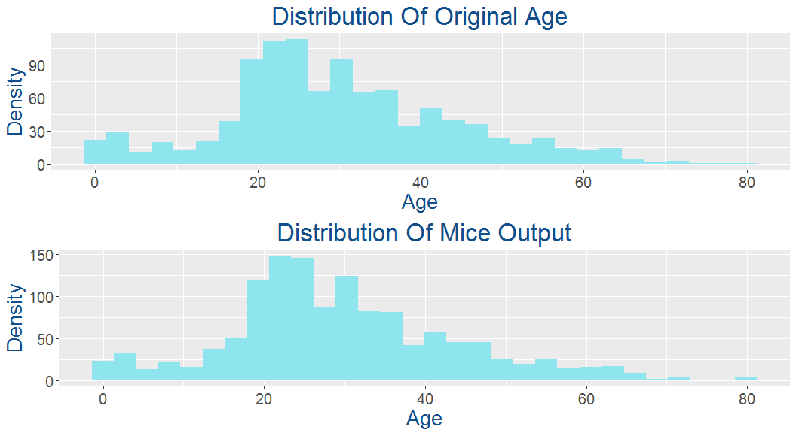

# Exploratory Data Analysis Of The Titanic Dataset
Kantesh Biswas  
August 4, 2017  


## Introduction
This markdown document is about exploratory data analysis on the Titanic dataset.
The first thing that i am going to do is some feature engineering.I am also going to make some really cool visualizations and at the end i am going to use **Random Forest** to make predictions.

The following section provides a brief description about all the columns in our train and test datasets.

Variable Name | Description
--------------|-------------
Survived      | Survived (1) or died (0)
Pclass        | Passenger's class
Name          | Passenger's name
Sex           | Passenger's sex
Age           | Passenger's age
SibSp         | Number of siblings/spouses aboard
Parch         | Number of parents/children aboard
Ticket        | Ticket number
Fare          | Fare
Cabin         | Cabin
Embarked      | Port of embarkation

## First thing first let's load all the libraries that we will be using.


```r
library(ggplot2)
library(dplyr)
library(mice)
library(randomForest)
library(scales)
library(gridExtra)
library(knitr)
```

Now that our packages are loaded let's load the datasets.


```r
train<-read.csv("train.csv",header = T)
test<-read.csv("test.csv",header = T)
combined<-bind_rows(train,test)
```
Here we have combined our train and test dataset because before starting model building we will do some feature engineering which will definately increase the accuracy of our model.
Since the datasets are loaded let's have a look at the structures of our datasets.


```r
str(combined)
```

```
## 'data.frame':	1309 obs. of  12 variables:
##  $ PassengerId: int  1 2 3 4 5 6 7 8 9 10 ...
##  $ Survived   : int  0 1 1 1 0 0 0 0 1 1 ...
##  $ Pclass     : int  3 1 3 1 3 3 1 3 3 2 ...
##  $ Name       : chr  "Braund, Mr. Owen Harris" "Cumings, Mrs. John Bradley (Florence Briggs Thayer)" "Heikkinen, Miss. Laina" "Futrelle, Mrs. Jacques Heath (Lily May Peel)" ...
##  $ Sex        : Factor w/ 2 levels "female","male": 2 1 1 1 2 2 2 2 1 1 ...
##  $ Age        : num  22 38 26 35 35 NA 54 2 27 14 ...
##  $ SibSp      : int  1 1 0 1 0 0 0 3 0 1 ...
##  $ Parch      : int  0 0 0 0 0 0 0 1 2 0 ...
##  $ Ticket     : chr  "A/5 21171" "PC 17599" "STON/O2. 3101282" "113803" ...
##  $ Fare       : num  7.25 71.28 7.92 53.1 8.05 ...
##  $ Cabin      : chr  "" "C85" "" "C123" ...
##  $ Embarked   : chr  "S" "C" "S" "S" ...
```

We will convert **Survived**,**Pclass** & **Embarked** variable as **factors** which will be very usefull for our future analysis.


```r
combined$Survived<-as.factor(combined$Survived)
combined$Embarked<-as.factor(combined$Embarked)
combined$Pclass<-as.factor(combined$Pclass)
train$Survived<-as.factor(train$Survived)
train$Embarked<-as.factor(train$Embarked)
train$Pclass<-as.factor(train$Pclass)
```


Let's check how many people have survived in our training dataset.


```r
table(train$Survived)
```

```
## 
##   0   1 
## 549 342
```

342 survived out of 549.Well we can also find the percentage of people that survived by using the following command.


```r
prop.table(table(train$Survived))
```

```
## 
##         0         1 
## 0.6161616 0.3838384
```

We can see that 38% of people has survived the disaster.That means most of the people abroad were perished. Let's check the number of male and female passengers in our training dataset.


```r
table(train$Sex)
```

```
## 
## female   male 
##    314    577
```

Well majority of the passengers were male.Now let's find out the proportion of male and female passengers that survived the disaster.


```r
prop.table(table(train$Sex,train$Survived))
```

```
##         
##                   0          1
##   female 0.09090909 0.26150393
##   male   0.52525253 0.12233446
```

By default the proportion table command takes each entry in the table and divides by the total number of passengers.But we want to see the proportion of each sex that survived, as separate groups.We will pass one more argument **1** to our function which stands for the rows.**2** stands for columns.


```r
prop.table(table(train$Sex,train$Survived),1)
```

```
##         
##                  0         1
##   female 0.2579618 0.7420382
##   male   0.8110919 0.1889081
```

Very low percentage of male survived whereas majority of females abroad were survived.

First we are going to check the **Embarked** variable because that's where the journey begins.


```r
table(train$Embarked)
```

```
## 
##       C   Q   S 
##   2 168  77 644
```

```r
table(combined$Embarked)
```

```
## 
##       C   Q   S 
##   2 270 123 914
```

There are no embarkment details for two Passengers in our train dataset. Let's find out their details.


```r
train[train$Embarked=="",]
```

```
##     PassengerId Survived Pclass                                      Name
## 62           62        1      1                       Icard, Miss. Amelie
## 830         830        1      1 Stone, Mrs. George Nelson (Martha Evelyn)
##        Sex Age SibSp Parch Ticket Fare Cabin Embarked
## 62  female  38     0     0 113572   80   B28         
## 830 female  62     0     0 113572   80   B28
```

Well the passenger id's are **62** & **830**.
Maybe we can guess their embarkment details by looking at the Passenger class in which they were travelling and the amount which they have paid for their ticket.


```r
train$Fare[train$Embarked == ""]
```

```
## [1] 80 80
```

```r
train$Pclass[train$Embarked == ""]
```

```
## [1] 1 1
## Levels: 1 2 3
```

Both of them paid **80$** & were travelling in **Passenger clas 1**.

Time for our first visualization.

***

<!-- -->

***

Well the median fare for Passenger class 1 is 80 dollar & both of the passengers paid 80 dollar.So we can impute those missing values with **Cherbourg** .


```r
train$Embarked[c(62, 830)] <- 'C'
```

Let's check the summary of our combined dataset so that we will get an clear idea about the missing values.


```r
summary(combined)
```

```
##   PassengerId   Survived   Pclass      Name               Sex     
##  Min.   :   1   0   :549   1:323   Length:1309        female:466  
##  1st Qu.: 328   1   :342   2:277   Class :character   male  :843  
##  Median : 655   NA's:418   3:709   Mode  :character               
##  Mean   : 655                                                     
##  3rd Qu.: 982                                                     
##  Max.   :1309                                                     
##                                                                   
##       Age            SibSp            Parch          Ticket         
##  Min.   : 0.17   Min.   :0.0000   Min.   :0.000   Length:1309       
##  1st Qu.:21.00   1st Qu.:0.0000   1st Qu.:0.000   Class :character  
##  Median :28.00   Median :0.0000   Median :0.000   Mode  :character  
##  Mean   :29.88   Mean   :0.4989   Mean   :0.385                     
##  3rd Qu.:39.00   3rd Qu.:1.0000   3rd Qu.:0.000                     
##  Max.   :80.00   Max.   :8.0000   Max.   :9.000                     
##  NA's   :263                                                        
##       Fare            Cabin           Embarked
##  Min.   :  0.000   Length:1309         :  2   
##  1st Qu.:  7.896   Class :character   C:270   
##  Median : 14.454   Mode  :character   Q:123   
##  Mean   : 33.295                      S:914   
##  3rd Qu.: 31.275                              
##  Max.   :512.329                              
##  NA's   :1
```

Fare column has one missing values.Let's find out the details of that passenger.


```r
which(is.na(combined$Fare))
```

```
## [1] 1044
```

```r
combined[1044,]
```

```
##      PassengerId Survived Pclass               Name  Sex  Age SibSp Parch
## 1044        1044     <NA>      3 Storey, Mr. Thomas male 60.5     0     0
##      Ticket Fare Cabin Embarked
## 1044   3701   NA              S
```

Well the passenger was travelling in Passenger class 3 & his boarding point was Southampton.
So we can impute that missing value using the median fare of all the passengers who were travelling in passenger class 3 & boarded the ship from Southampton.


```r
combined$Fare[1044]<-median(combined[combined$Pclass == '3' & combined$Embarked == 'S',]$Fare,na.rm = TRUE)
```

We will start imputing the missing values in the age variable.We will work with the combined dataset because so that we don't have to repeat the same process for our test dataset.


```r
summary(combined$Age)
```

```
##    Min. 1st Qu.  Median    Mean 3rd Qu.    Max.    NA's 
##    0.17   21.00   28.00   29.88   39.00   80.00     263
```

There are 263 NA values.Let's impute all those NA values.We will use **Mice** package for imputation.


```r
md.pattern(combined)
```

```
##     PassengerId Pclass Sex SibSp Parch Fare Embarked Age Ticket Survived
## 521           1      1   1     1     1    1        1   1      1        1
## 232           1      1   1     1     1    1        1   1      1        0
## 140           1      1   1     1     1    1        1   0      1        1
## 193           1      1   1     1     1    1        1   1      0        1
##  64           1      1   1     1     1    1        1   0      1        0
## 100           1      1   1     1     1    1        1   1      0        0
##  37           1      1   1     1     1    1        1   0      0        1
##  22           1      1   1     1     1    1        1   0      0        0
##               0      0   0     0     0    0        0 263    352      418
##     Name Cabin     
## 521    0     0    2
## 232    0     0    3
## 140    0     0    3
## 193    0     0    3
##  64    0     0    4
## 100    0     0    4
##  37    0     0    4
##  22    0     0    5
##     1309  1309 3651
```

* We are not going to use the following variables for our imputation process.
    + PassengerId
    + Name
    + Ticket
    + Cabin
    + Survived


```r
imp<-mice(combined[,!names(combined) %in% c("PassengerId","Name","Ticket","Cabin","Survived")],method = "rf")
```

Let's have a look at the imputed values for **age** variable.


```r
head(imp$imp$Age)
```

```
##     1  2  3  4  5
## 6  24 18 25 25 21
## 18 50 23 23 22 30
## 20 15 29 25 45 33
## 27 27 15 21 20 19
## 29 63 25 28 28 21
## 30 51 25 34 18 24
```


```r
MiceOutput<-complete(imp)
```

Let's compare the output of **Mice** with our original data to ensure that we have correctly imputed the missing values.

***

<!-- -->

***

Look's good.Now we will replace our **Age** column in the original data with the **Mice** output. 


```r
combined$Age<-MiceOutput$Age
```

Let's cross check if there is any missing values left behind.


```r
sum(is.na(combined$Age))
```

```
## [1] 0
```

Our age variable is complete now.Let's visualize it to see if we can find any new insights.

***

<!-- -->

***

Look's great.It's clearly visible that the chances of survival is much higher for **female** passengers regardless of their age.

Titanic was also famous for rescuing the childrens and mothers first,maybe we can use that concept.We will add two new features **Child** & **Mother** to our dataset.For child variable we will simply compare the age with **18**.If it is less than 18 then we will call that passenger a **Child** otherwise **Adult** and a mother will be a **female** passenger whose age is more than **18**,who has more than **0** children and does not have the title **Miss**. That means before proceeding we have to take the names column and extract the **titles**.


```r
combined$Name<-as.character(combined$Name)
combined$Title<-sapply(combined$Name,FUN = function(x){strsplit(x,split = '[,.]')[[1]][2]})
combined$Title<-sub(' ','',combined$Title)
combined$Title<-as.factor(combined$Title)
levels(combined$Title)
```

```
##  [1] "Capt"         "Col"          "Don"          "Dona"        
##  [5] "Dr"           "Jonkheer"     "Lady"         "Major"       
##  [9] "Master"       "Miss"         "Mlle"         "Mme"         
## [13] "Mr"           "Mrs"          "Ms"           "Rev"         
## [17] "Sir"          "the Countess"
```


```r
summary(combined$Title)
```

```
##         Capt          Col          Don         Dona           Dr 
##            1            4            1            1            8 
##     Jonkheer         Lady        Major       Master         Miss 
##            1            1            2           61          260 
##         Mlle          Mme           Mr          Mrs           Ms 
##            2            1          757          197            2 
##          Rev          Sir the Countess 
##            8            1            1
```


```r
table(combined$Sex,combined$Title)
```

```
##         
##          Capt Col Don Dona  Dr Jonkheer Lady Major Master Miss Mlle Mme
##   female    0   0   0    1   1        0    1     0      0  260    2   1
##   male      1   4   1    0   7        1    0     2     61    0    0   0
##         
##           Mr Mrs  Ms Rev Sir the Countess
##   female   0 197   2   0   0            1
##   male   757   0   0   8   1            0
```

We can group some of the titles so that it will be easier to interpret.


```r
combined$Title[combined$Title %in% c('Rev','Jonkheer', 'Major', 'Master', 'Capt', 'Col', 'Don')] <- 'Sir'
combined$Title[combined$Title %in% c('the Countess','Dona')] <- 'Lady'
combined$Title[combined$Title %in% c('Mlle', 'Ms')] <- 'Miss'
combined$Title[combined$Title == 'Mme'] <- 'Mrs'
combined$Title[combined$Title == 'Dr' & combined$Sex == 'female'] <- 'Miss'
combined$Title[combined$Title == 'Dr' & combined$Sex == 'male'] <- 'Sir'
levels(combined$Title)
```

```
##  [1] "Capt"         "Col"          "Don"          "Dona"        
##  [5] "Dr"           "Jonkheer"     "Lady"         "Major"       
##  [9] "Master"       "Miss"         "Mlle"         "Mme"         
## [13] "Mr"           "Mrs"          "Ms"           "Rev"         
## [17] "Sir"          "the Countess"
```

```r
combined$Title<-droplevels(combined$Title)
summary(combined$Title)
```

```
## Lady Miss   Mr  Mrs  Sir 
##    3  265  757  198   86
```

Now we can create our 2 new features **Child** and **Mother**.


```r
combined$Child <- ifelse(combined$Age < 18,"Child","Adult")
combined$Mother <- ifelse(combined$Sex == "female" & combined$Parch > 0 & combined$Age > 18 & combined$Title != "Miss","Mother","Not Mother")
```

Let's find out the number of **Adults** and **Childrens** in our training dataset by gender.


```r
table(combined[1:891,]$Child,combined[1:891,]$Sex)
```

```
##        
##         female male
##   Adult    245  510
##   Child     69   67
```

```r
table(combined[1:891,]$Mother,combined[1:891,]$Sex)
```

```
##             
##              female male
##   Mother         54    0
##   Not Mother    260  577
```

Now we will make a new visualization to check the survival rate of childrens & mothers.

***

<!-- -->

***

Chances of survival for **Child** & **Mothers** are higher than **Adults** & **Not Mothers** respectively.

Now we will analyze the fare column using a visualization.

***

<!-- -->

***

Well from our plot we can clearly say that there were lot's of male passengers who bought a relatively cheaper ticket than the other male and female passengers.Maybe they were travelling alone or like **Jack & his friends** or there might be some other reasons.
Let's see if there is any relationship between **Passenger Fare** & **Survival Rate**. 

***

<!-- -->

***

Well it's clearly visible that most of the passengers who bought a relatively cheaper ticket didn't survived the disaster.Maybe that is one of the reasons behind the low survival rate of the **male** passengers.

Time for our next visualization where we will try to figure out the relatioship between **Passenger Class**,**Fare** & **Survival Rate**.
We will make one more plot which is similar to this plot but this time we will use **Sex** in the place of **Survival Rate** to see the number of male and female population in each class and how much did they pay for their ticket.

***

<!-- -->

***

* This plot tells us a lot of things.
    + Mean fare for Passenger class 3 was much lower than the other two classes.
    + Some of the passengers bought expensive ticket,but still they were travelling in Passenger Class 3.

Time for our next plot to check the number of male & female passengers in each class.

***

<!-- -->

***

From the last two plots we can come to the conclusion that lot's of **female** passengers who were travelling in the **3rd class** didn't survived the disaster.One more thing to notice that many of the the 3rd class **male** & **female** passengers actually paid a higher price to buy a ticket.Well we don't know the reason for that.

Now to better understand the Survival Rate according to the Passenger Class we will create a new visualization.

***


```r
train.Pclass<-combined[1:891,] %>%
  group_by(Pclass,Survived) %>%
  summarise(count=n()) %>%
  mutate(SurRate=count/sum(count))
train.Pclass
```

```
## Source: local data frame [6 x 4]
## Groups: Pclass [3]
## 
##   Pclass Survived count   SurRate
##   <fctr>   <fctr> <int>     <dbl>
## 1      1        0    80 0.3703704
## 2      1        1   136 0.6296296
## 3      2        0    97 0.5271739
## 4      2        1    87 0.4728261
## 5      3        0   372 0.7576375
## 6      3        1   119 0.2423625
```

***

<!-- -->

***

**Class 1** passenger has the highest survival rate followed by **Class 2** & **Class 3**.

Some of the female passengers who were travelling in **Passenger class 3** and paid a relatively higher price (more than 20$) for their ticket didn't survived the disaster.

Now we will try to find out if there is any relationship between **Port Of Embarkation** & **Survival Rate** using the following visualization.

***


```r
train.Embarked<-combined[1:891,] %>%
  filter(Embarked != "") %>%
  group_by(Embarked,Survived) %>%
  summarise(count=n()) %>%
  mutate(SurRate=count/sum(count))
train.Embarked
```

```
## Source: local data frame [6 x 4]
## Groups: Embarked [3]
## 
##   Embarked Survived count   SurRate
##     <fctr>   <fctr> <int>     <dbl>
## 1        C        0    75 0.4464286
## 2        C        1    93 0.5535714
## 3        Q        0    47 0.6103896
## 4        Q        1    30 0.3896104
## 5        S        0   427 0.6630435
## 6        S        1   217 0.3369565
```

***


<!-- -->

***

**Cherbourg** has the highest survival Rate followed by **Queenstowna** & **Southampton**.

***

Let's find out the impact on survival rate of a passenger who has siblings onboard.


```r
train.SibSp<-combined[1:891,] %>%
  group_by(SibSp,Survived) %>%
  summarise(count=n()) %>%
  mutate(SurRate=count/sum(count))
train.SibSp
```

```
## Source: local data frame [12 x 4]
## Groups: SibSp [7]
## 
##    SibSp Survived count   SurRate
##    <int>   <fctr> <int>     <dbl>
## 1      0        0   398 0.6546053
## 2      0        1   210 0.3453947
## 3      1        0    97 0.4641148
## 4      1        1   112 0.5358852
## 5      2        0    15 0.5357143
## 6      2        1    13 0.4642857
## 7      3        0    12 0.7500000
## 8      3        1     4 0.2500000
## 9      4        0    15 0.8333333
## 10     4        1     3 0.1666667
## 11     5        0     5 1.0000000
## 12     8        0     7 1.0000000
```


***

<!-- -->

Well it looks like passengers with more siblings onboard are less likely to **Survive**.

We are going to make a similar plot but this time we want to see the impact on survival rate of a passenger who has Parents/Children onboard.


```r
train.Parch<-combined[1:891,] %>%
  group_by(Parch,Survived) %>%
  summarise(count=n()) %>%
  mutate(SurRate=count/sum(count))
train.Parch
```

```
## Source: local data frame [12 x 4]
## Groups: Parch [7]
## 
##    Parch Survived count   SurRate
##    <int>   <fctr> <int>     <dbl>
## 1      0        0   445 0.6563422
## 2      0        1   233 0.3436578
## 3      1        0    53 0.4491525
## 4      1        1    65 0.5508475
## 5      2        0    40 0.5000000
## 6      2        1    40 0.5000000
## 7      3        0     2 0.4000000
## 8      3        1     3 0.6000000
## 9      4        0     4 1.0000000
## 10     5        0     4 0.8000000
## 11     5        1     1 0.2000000
## 12     6        0     1 1.0000000
```

***

<!-- -->

The output of this plot is also very similar to the previous one.**Passengers** with less number of **Parents/Childrens** onboard are more likely to survive.
Well we can use the **Parch** variable to analyze the impact on survival rate for **male** passengers who has more than 2 relationships.


```r
train.Parch<-combined[1:891,] %>%
  filter(Sex == "male") %>%
  group_by(Parch,Survived) %>%
  summarise(count=n()) %>%
  mutate(SurRate=count/sum(count))
train.Parch
```

```
## Source: local data frame [9 x 4]
## Groups: Parch [6]
## 
##   Parch Survived count   SurRate
##   <int>   <fctr> <int>     <dbl>
## 1     0        0   404 0.8347107
## 2     0        1    80 0.1652893
## 3     1        0    39 0.6724138
## 4     1        1    19 0.3275862
## 5     2        0    21 0.6774194
## 6     2        1    10 0.3225806
## 7     3        0     1 1.0000000
## 8     4        0     2 1.0000000
## 9     5        0     1 1.0000000
```
<!-- -->

***

Well it seems like none of the male with more than 2 **Parent/children** survived the disaster as compared to the other males onboard.

We will make a new feature **Family Size** & then we will try to see if there is any relationship between **Family Size** & **Survival Rate**.


```r
combined$FamilySize<-combined$SibSp+combined$Parch+1
```


```r
combined.FamilySize<-combined[1:891,] %>%
  group_by(FamilySize,Survived) %>%
  summarise(count=n()) %>%
  mutate(SurRate=count/sum(count))
combined.FamilySize
```

```
## Source: local data frame [16 x 4]
## Groups: FamilySize [9]
## 
##    FamilySize Survived count   SurRate
##         <dbl>   <fctr> <int>     <dbl>
## 1           1        0   374 0.6964618
## 2           1        1   163 0.3035382
## 3           2        0    72 0.4472050
## 4           2        1    89 0.5527950
## 5           3        0    43 0.4215686
## 6           3        1    59 0.5784314
## 7           4        0     8 0.2758621
## 8           4        1    21 0.7241379
## 9           5        0    12 0.8000000
## 10          5        1     3 0.2000000
## 11          6        0    19 0.8636364
## 12          6        1     3 0.1363636
## 13          7        0     8 0.6666667
## 14          7        1     4 0.3333333
## 15          8        0     6 1.0000000
## 16         11        0     7 1.0000000
```

***

<!-- -->

***

Well it's clearly visible that **Smaller families** are more lkely to survive disaster.

We will make a similar visualization to see the proportion of survival according to the Familysize just for beter understanding .

***

<!-- -->

***

That's the beauty of visualization.Till now we were thinking that **the chances of survival is vey high for a solo traveller** but in reality it was not.**69.6%** of solo traveller died on that night.

It's very difficult for a large family to stick together at the time of any emergency.Maybe that's the element reason behind the low survival rate for any families greater than size **4**. Chances of survival was much higher for a relatively small family. We will create a new feature **FamilyId** where we will try to group the different families based on their **Surnames** so that our model can easily recognize the members of a single family. So first we need to extract the **Surnames** from the names.


```r
combined$Name<-as.character(combined$Name)
combined$SurName<-sapply(combined$Name,FUN = function(x){strsplit(x,split = '[,.]')[[1]][1]})
```

Now we will paste the **Family Size** in front of the Surnames to distinguish the different families.We need to convert **FamilySize** as **strings** otherwise we won't be able to paste it with the surnames.


```r
combined$FamilyId<-paste(as.character(combined$FamilySize),combined$SurName,sep = '')
```

Well there are so many people with the same surname and majority of the passengers were solo traveller.

* To solve this problem we will group the families according to their size.
    + Family size **1** represent **solo**.
    + We will name all those families as **small** whose size is **2**.

    

```r
combined$FamilyId[combined$FamilySize == 1] <- "solo"
table(combined$FamilyId)
```

```
## 
##                11Sage              2Abelson                2Ahlin 
##                    11                     2                     1 
##                  2Aks      2Andersen-Jensen              2Andrews 
##                     2                     1                     1 
##                2Angle       2Arnold-Franchi                2Astor 
##                     2                     2                     2 
##            2Backstrom              2Barbara               2Baxter 
##                     1                     2                     2 
##                2Beane               2Bishop             2Bowerman 
##                     2                     2                     1 
##               2Braund                2Bryhl                2Caram 
##                     2                     2                     2 
##              2Cardeza               2Carter            2Cavendish 
##                     2                     2                     2 
##              2Chaffee             2Chambers              2Chapman 
##                     2                     2                     2 
##             2Chibnall         2Chronopoulos                2Clark 
##                     1                     2                     2 
##               2Clarke                2Cribb              2Cumings 
##                     2                     2                     2 
##             2Davidson              2Davison       2de Messemaeker 
##                     1                     2                     2 
##            2del Carlo                 2Dick               2Doling 
##                     2                     2                     2 
##              2Douglas          2Duff Gordon         2Duran y More 
##                     2                     2                     2 
##                2Dyker             2Earnshaw               2Eustis 
##                     2                     1                     1 
##           2Faunthorpe           2Frauenthal             2Futrelle 
##                     2                     2                     2 
##                 2Gale               2Gibson                2Giles 
##                     2                     2                     2 
##           2Goldenberg               2Graham           2Greenfield 
##                     2                     2                     2 
##              2Hagland          2Hakkarainen               2Hansen 
##                     2                     2                     2 
##               2Harder               2Harper               2Harris 
##                     2                     4                     2 
##              2Hippach             2Hirvonen             2Hogeboom 
##                     2                     1                     1 
##                 2Hold            2Holverson               2Howard 
##                     2                     2                     2 
##                 2Hoyt           2Ilmakangas            2Jacobsohn 
##                     2                     2                     1 
##               2Jensen              2Jussila               2Kantor 
##                     1                     2                     2 
##                2Karun               2Kenyon               2Khalil 
##                     2                     2                     2 
##              2Kiernan              2Kimball               2Lennon 
##                     2                     2                     2 
##              2Lindell            2Lindqvist                2Lines 
##                     2                     1                     2 
##                 2Lobb                2Louch               2Madill 
##                     2                     2                     1 
##               2Marvin              2McNamee            2Mellinger 
##                     2                     2                     2 
##                2Meyer              2Minahan                 2Mock 
##                     2                     2                     1 
##                 2Moor                2Moran               2Murphy 
##                     2                     2                     2 
##               2Nasser               2Natsch               2Newell 
##                     2                     1                     2 
##        2Nicola-Yarred              2O'Brien                2Olsen 
##                     2                     2                     2 
##                2Ostby              2Parrish                2Pears 
##                     2                     1                     2 
## 2Penasco y Castellana              2Persson            2Petterson 
##                     2                     1                     1 
##             2Phillips               2Potter               2Renouf 
##                     2                     1                     1 
##               2Robert               2Robins           2Rothschild 
##                     1                     2                     2 
##             2Schabert              2Shelley               2Silvey 
##                     1                     1                     2 
##                2Smith               2Snyder              2Spencer 
##                     2                     2                     2 
##              2Stengel           2Stephenson               2Straus 
##                     2                     1                     2 
##                2Strom               2Taylor               2Thomas 
##                     1                     2                     2 
##         2Thorneycroft               2Turpin        2Vander Planke 
##                     2                     2                     1 
##                 2Ware               2Warren                2Weisz 
##                     2                     2                     2 
##                2White              2Wiklund               2Wilkes 
##                     2                     2                     1 
##             2Williams              2Yasbeck               2Zabour 
##                     2                     2                     2 
##               3Abbott             3Appleton             3Beckwith 
##                     3                     1                     2 
##               3Boulos               3Bourke                3Brown 
##                     3                     3                     4 
##             3Caldwell              3Christy              3Collyer 
##                     3                     2                     3 
##              3Compton              3Cornell               3Coutts 
##                     3                     1                     3 
##               3Crosby               3Danbom               3Davies 
##                     3                     3                     5 
##                3Dodge              3Douglas                 3Drew 
##                     3                     1                     3 
##                3Elias           3Frauenthal            3Frolicher 
##                     3                     1                     1 
##     3Frolicher-Stehli            3Goldsmith           3Gustafsson 
##                     2                     3                     2 
##           3Hamalainen               3Hansen                 3Hart 
##                     2                     1                     3 
##                 3Hays              3Hickman             3Hiltunen 
##                     2                     3                     1 
##             3Hirvonen             3Jefferys              3Johnson 
##                     1                     2                     3 
##                 3Kink        3Kink-Heilmann               3Klasen 
##                     2                     2                     3 
##             3Lahtinen               3Mallet                3McCoy 
##                     2                     3                     3 
##              3Minahan             3Moubarek                3Nakid 
##                     1                     3                     3 
##             3Navratil               3Newell               3Newsom 
##                     3                     1                     1 
##             3Nicholls              3Peacock                3Peter 
##                     1                     3                     3 
##                3Quick             3Richards              3Rosblom 
##                     3                     2                     3 
##               3Samaan            3Sandstrom               3Silven 
##                     3                     3                     1 
##              3Spedden                3Strom              3Taussig 
##                     3                     1                     3 
##               3Thayer               3Thomas                3Touma 
##                     3                     1                     3 
##         3van Billiard             3Van Impe        3Vander Planke 
##                     3                     3                     2 
##                3Wells                 3Wick              3Widener 
##                     3                     3                     3 
##              4Allison            4Backstrom              4Baclini 
##                     4                     1                     4 
##               4Becker               4Carter             4Davidson 
##                     4                     4                     1 
##                 4Dean               4Herman              4Hocking 
##                     4                     4                     2 
##            4Jacobsohn             4Johnston              4Laroche 
##                     1                     4                     4 
##               4Renouf        4Vander Planke                 4West 
##                     1                     1                     4 
##                 5Ford              5Hocking        5Kink-Heilmann 
##                     5                     1                     1 
##              5Lefebre              5Palsson              5Ryerson 
##                     5                     5                     5 
##              6Fortune               6Panula                 6Rice 
##                     6                     6                     6 
##             6Richards                6Skoog            7Andersson 
##                     1                     6                     9 
##              7Asplund              8Goodwin                  solo 
##                     7                     8                   790
```

Well there are lot's of family id's with only one or two members.To filter out all those families we will use the following procedure.


```r
FamilyTable<-data.frame(table(combined$FamilyId))
kable(head(FamilyTable))
```


Var1                Freq
-----------------  -----
11Sage                11
2Abelson               2
2Ahlin                 1
2Aks                   2
2Andersen-Jensen       1
2Andrews               1

We have stored the output of table function as a dataframe. Now we are going to subset this dataframe to show only the families with **1** or **2** members and we are going to subset it separately.


```r
FamilyTable_2<-FamilyTable[FamilyTable$Freq ==2,]
FamilyTable_1<-FamilyTable[FamilyTable$Freq ==1,]
```

Now we are going to subset our original dataset with these **2** dataframes.


```r
combined$FamilyId[combined$FamilyId %in% FamilyTable_1$Var1]<-"solo"
combined$FamilyId[combined$FamilyId %in% FamilyTable_2$Var1]<-"small"
combined$FamilyId<-as.factor(combined$FamilyId)
```

We have already added the feature title to our dataset.Let's make a visualization to see the survival rate according to **Title**.
Now we will make a new visualization.


```r
combined.Title<-combined[1:891,] %>%
  group_by(Title,Survived) %>%
  summarise(count=n()) %>%
  mutate(SurRate=count/sum(count))
combined.Title
```

```
## Source: local data frame [9 x 4]
## Groups: Title [5]
## 
##    Title Survived count   SurRate
##   <fctr>   <fctr> <int>     <dbl>
## 1   Lady        1     2 1.0000000
## 2   Miss        0    55 0.2956989
## 3   Miss        1   131 0.7043011
## 4     Mr        0   436 0.8433269
## 5     Mr        1    81 0.1566731
## 6    Mrs        0    26 0.2063492
## 7    Mrs        1   100 0.7936508
## 8    Sir        0    32 0.5333333
## 9    Sir        1    28 0.4666667
```

***

<!-- -->

***

Survival Rate was lowest with **Mr** & **Lady** Survived the most.
Some of the passenger name contains additional names in brackets.Maybe this indicates their social status.


```r
combined$AdditionalName<-ifelse(grepl("\\(",combined$Name),"Y","N")
combined.AdditionalName<-combined[1:891,] %>%
  group_by(AdditionalName,Survived) %>%
  summarise(count=n()) %>%
  mutate(SurRate=count/sum(count))
combined.AdditionalName
```

```
## Source: local data frame [4 x 4]
## Groups: AdditionalName [2]
## 
##   AdditionalName Survived count   SurRate
##            <chr>   <fctr> <int>     <dbl>
## 1              N        0   516 0.6898396
## 2              N        1   232 0.3101604
## 3              Y        0    33 0.2307692
## 4              Y        1   110 0.7692308
```

***

<!-- -->

***

If you have additional names in brackets then your chances of survival is higher than the other passengers.

Similarly we can check for names with **Quotes**.


```r
combined$QuotesInNames<-ifelse(grepl('\\"',combined$Name),"Y","N")
combined.QuotesInNames<-combined[1:891,] %>%
  group_by(QuotesInNames,Survived) %>%
  summarise(count=n()) %>%
  mutate(SurRate=count/sum(count))
combined.QuotesInNames
```

```
## Source: local data frame [4 x 4]
## Groups: QuotesInNames [2]
## 
##   QuotesInNames Survived count   SurRate
##           <chr>   <fctr> <int>     <dbl>
## 1             N        0   534 0.6372315
## 2             N        1   304 0.3627685
## 3             Y        0    15 0.2830189
## 4             Y        1    38 0.7169811
```

***

<!-- -->

***

Well same thing with Quotes in names.If your name contains quoted characters then you are more likely to survive the disaster.

Now we are left with the **cabin** & **ticket** variables.Let's have a look at these two variables.


```r
length(which(combined$Cabin==""))
```

```
## [1] 1014
```

There are total **1309** records in our dataset and **1014** records have no values for **cabin**.So we are not going to analyze this variable further.Same with **ticket** variable it's very difficult to analyze as the format is not well defined.We have already analyzed most of the variables and introduced new features so we can exclude these two variables.

Now we will split our combined dataset into train & test set.


```r
train<-combined[1:891,]
test<-combined[892:1309,]
```


