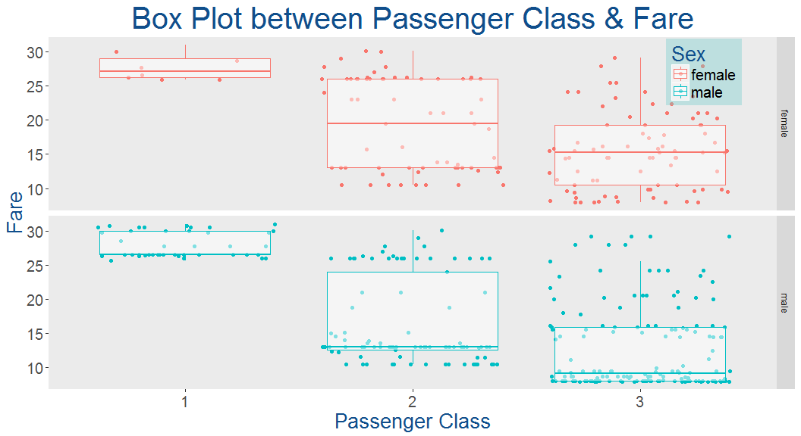

# Exploratory Data Analysis Of The Titanic Dataset
Kantesh Biswas  
August 4, 2017  


## Introduction
This markdown document is about exploratory data analysis on the Titanic dataset.
The first thing that i am going to do is some feature engineering.I am also going to make some really cool visualizations and at the end i am going to use **Random Forest** to make predictions.

The following section provides a brief description about all the columns in our train and test datasets.

Variable Name | Description
--------------|-------------
Survived      | Survived (1) or died (0)
Pclass        | Passenger's class
Name          | Passenger's name
Sex           | Passenger's sex
Age           | Passenger's age
SibSp         | Number of siblings/spouses aboard
Parch         | Number of parents/children aboard
Ticket        | Ticket number
Fare          | Fare
Cabin         | Cabin
Embarked      | Port of embarkation

## First thing first let's load all the libraries that we will be using.


```r
library(ggplot2)
library(dplyr)
library(mice)
library(randomForest)
```

Now that our packages are loaded let's load the datasets.


```r
train<-read.csv("train.csv",header = T)
test<-read.csv("test.csv",header = T)
combined<-bind_rows(train,test)
```
Here we have combined our train and test dataset because before starting model building we will do some feature engineering which will definately increase the accuracy of our model.
Since the datasets are loaded let's have a look at the structures of our datasets.


```r
str(train)
```

```
## 'data.frame':	891 obs. of  12 variables:
##  $ PassengerId: int  1 2 3 4 5 6 7 8 9 10 ...
##  $ Survived   : int  0 1 1 1 0 0 0 0 1 1 ...
##  $ Pclass     : int  3 1 3 1 3 3 1 3 3 2 ...
##  $ Name       : Factor w/ 891 levels "Abbing, Mr. Anthony",..: 109 191 358 277 16 559 520 629 417 581 ...
##  $ Sex        : Factor w/ 2 levels "female","male": 2 1 1 1 2 2 2 2 1 1 ...
##  $ Age        : num  22 38 26 35 35 NA 54 2 27 14 ...
##  $ SibSp      : int  1 1 0 1 0 0 0 3 0 1 ...
##  $ Parch      : int  0 0 0 0 0 0 0 1 2 0 ...
##  $ Ticket     : Factor w/ 681 levels "110152","110413",..: 524 597 670 50 473 276 86 396 345 133 ...
##  $ Fare       : num  7.25 71.28 7.92 53.1 8.05 ...
##  $ Cabin      : Factor w/ 148 levels "","A10","A14",..: 1 83 1 57 1 1 131 1 1 1 ...
##  $ Embarked   : Factor w/ 4 levels "","C","Q","S": 4 2 4 4 4 3 4 4 4 2 ...
```

```r
str(test)
```

```
## 'data.frame':	418 obs. of  11 variables:
##  $ PassengerId: int  892 893 894 895 896 897 898 899 900 901 ...
##  $ Pclass     : int  3 3 2 3 3 3 3 2 3 3 ...
##  $ Name       : Factor w/ 418 levels "Abbott, Master. Eugene Joseph",..: 210 409 273 414 182 370 85 58 5 104 ...
##  $ Sex        : Factor w/ 2 levels "female","male": 2 1 2 2 1 2 1 2 1 2 ...
##  $ Age        : num  34.5 47 62 27 22 14 30 26 18 21 ...
##  $ SibSp      : int  0 1 0 0 1 0 0 1 0 2 ...
##  $ Parch      : int  0 0 0 0 1 0 0 1 0 0 ...
##  $ Ticket     : Factor w/ 363 levels "110469","110489",..: 153 222 74 148 139 262 159 85 101 270 ...
##  $ Fare       : num  7.83 7 9.69 8.66 12.29 ...
##  $ Cabin      : Factor w/ 77 levels "","A11","A18",..: 1 1 1 1 1 1 1 1 1 1 ...
##  $ Embarked   : Factor w/ 3 levels "C","Q","S": 2 3 2 3 3 3 2 3 1 3 ...
```

```r
str(combined)
```

```
## 'data.frame':	1309 obs. of  12 variables:
##  $ PassengerId: int  1 2 3 4 5 6 7 8 9 10 ...
##  $ Survived   : int  0 1 1 1 0 0 0 0 1 1 ...
##  $ Pclass     : int  3 1 3 1 3 3 1 3 3 2 ...
##  $ Name       : chr  "Braund, Mr. Owen Harris" "Cumings, Mrs. John Bradley (Florence Briggs Thayer)" "Heikkinen, Miss. Laina" "Futrelle, Mrs. Jacques Heath (Lily May Peel)" ...
##  $ Sex        : Factor w/ 2 levels "female","male": 2 1 1 1 2 2 2 2 1 1 ...
##  $ Age        : num  22 38 26 35 35 NA 54 2 27 14 ...
##  $ SibSp      : int  1 1 0 1 0 0 0 3 0 1 ...
##  $ Parch      : int  0 0 0 0 0 0 0 1 2 0 ...
##  $ Ticket     : chr  "A/5 21171" "PC 17599" "STON/O2. 3101282" "113803" ...
##  $ Fare       : num  7.25 71.28 7.92 53.1 8.05 ...
##  $ Cabin      : chr  "" "C85" "" "C123" ...
##  $ Embarked   : chr  "S" "C" "S" "S" ...
```

Notice that in our test dataset there is no survived column because that's how kaggle works we need to predict the survival rate on the test dataset.

We will make **Survived** & **Pclass** variables as factors which will be very usefull at the time of making visualizations. 


```r
train$Pclass<-as.factor(train$Pclass)
train$Survived<-as.factor(train$Survived)
```

Let's check how many people have survived in our training dataset.


```r
table(train$Survived)
```

```
## 
##   0   1 
## 549 342
```

342 survived out of 549.Well we can also find the percentage of people that survived by using the following command.


```r
prop.table(table(train$Survived))
```

```
## 
##         0         1 
## 0.6161616 0.3838384
```

We can see that 38% of people has survived the disaster.That means most of the people abroad were perished.
Now let's make our first prediction,since most people died in our training set,perhaps we can assume that everyone in the test set also died.
So let's add our first prediction to the test set.


```r
test$Survived<-rep(0,418)
```

We need to submit a csv file with PassengerId and survived column to **Kaggle**.
So let's prepare our submission file.


```r
submit<-data.frame(PassengerId=test$PassengerId,Survived=test$Survived)
write.csv(submit,file = "Prediction_titanic.csv",row.names = FALSE)
```

Here we have excluded the row numbers oterwise kaggle will reject our submission.
As we know that at the time of the disaster women and children were saved first.Let's try to find that out.


```r
table(train$Sex)
```

```
## 
## female   male 
##    314    577
```

We can see that the majority of the passengers were male.Now let's find out the proportion of male and female passengers that survived the disaster.


```r
prop.table(table(train$Sex,train$Survived))
```

```
##         
##                   0          1
##   female 0.09090909 0.26150393
##   male   0.52525253 0.12233446
```

By default the proportion table command takes each entry in the table and divides by the total number of passengers.But we want to see the proportion of each sex that survived, as separate groups.We will pass one more argument **1** to our function which stands for the rows.**2** stands for columns.


```r
prop.table(table(train$Sex,train$Survived),1)
```

```
##         
##                  0         1
##   female 0.2579618 0.7420382
##   male   0.8110919 0.1889081
```

Well we can see that a very low percentage of male survived whereas majority of females abroad were survived.
Let's update our old prediction and mark all the females passenger in our test dataset as survived.


```r
test$Survived<-0
test$Survived[test$Sex=='female']<-1
```

Ok now we need to update our submission file also.


```r
submit<-data.frame(PassengerId=test$PassengerId,Survived=test$Survived)
write.csv(submit,file = "Prediction_titanic.csv",row.names = FALSE)
```

Now let's look into the age variable.


```r
summary(train$Age)
```

```
##    Min. 1st Qu.  Median    Mean 3rd Qu.    Max.    NA's 
##    0.42   20.12   28.00   29.70   38.00   80.00     177
```

There are 177 NA values.We will impute those NA values with the mean age of the rest of the passengers.
Let's create a new variable to find out if the passenger was below 18 or not.


```r
train$Child<-0
train$Child[train$Age<18]<-1
```

Let's find out the number of **Adults** and **Childrens** in our dataset by gender.
Aggregate function is very usefull when we want to apply a specific command for groups.


```r
aggregate(as.numeric(Survived)~Child+Sex,data = train,FUN = length)
```

```
##   Child    Sex as.numeric(Survived)
## 1     0 female                  259
## 2     1 female                   55
## 3     0   male                  519
## 4     1   male                   58
```

There are 259 female and 519 male adults in our dataset.Similarly 55 female and 58 male children are there.
Now we will find out how many male and female children survived the disaster.


```r
aggregate(as.numeric(Survived)~Child+Sex,data = train,FUN = sum)
```

```
##   Child    Sex as.numeric(Survived)
## 1     0 female                  454
## 2     1 female                   93
## 3     0   male                  605
## 4     1   male                   81
```

Here we can see **195** female **Adults** and **38** female children survived whereas **86** male **Adults** and **23** male children survived the disaster.
Now we are interested to know the proportion again.We can do that by using the following piece of code.


```r
aggregate(as.numeric(Survived)~Child+Sex,data = train,FUN = function(x){sum(x)/length(x)})
```

```
##   Child    Sex as.numeric(Survived)
## 1     0 female             1.752896
## 2     1 female             1.690909
## 3     0   male             1.165703
## 4     1   male             1.396552
```

Well it's clearly visible that the survival rate of females were much higher than males regrdless of their age.
Ok so there is nothing to change our prediction.Let's try to explore the other variables and see if we can find anything usefull.
Time for our first visualization where we will try analyze the **Fare** column.

***

<!-- -->

***

Well from our plot we can clearly say that there were lot's of male passengers who bought a relatively cheaper ticket than the other male and female passengers.Maybe they were travelling alone or like **Jack & his friends** or there might be some other reasons.
Let's see if there is any relationship between **Passenger Fare** & **Survival Rate**. 

***

<!-- -->

***

Well it's clearly visible that most of the passengers who bought a relatively cheaper ticket didn't survived the disaster.Maybe that is one of the reasons behind the low survival rate of the **male** passengers.

Time for our next visualization where we will try to figure out the relatioship between **Passenger Class**,**Fare** & **Survival Rate**.
We will make one more plot which is similar to this plot but this time we will use **Sex** in the place of **Survival Rate** to see the number of male and female population in each class and how much did they pay for their ticket.

***

<!-- -->

***

* This plot tells us a lot of things.
    + Mean fare for Passenger class 3 was much lower than the other two classes.
    + Some of the passengers bought expensive ticket,but still they were travelling in Passenger Class 3.
    + Also passenger class 3 has the lowest survival rate.

Time for our next plot to check the number of male & female passengers in each class.

***

<!-- -->

***

From the last two plots we can come to the conclusion that lot's of **female** passengers who were travelling in the **3rd class** didn't survived the disaster.One more thing to notice that many of the the 3rd class **male** & **female** passengers actually paid a higher price to buy a ticket.Well we don't know the reason for that.

Now to better understand the Survival Rate according to the Passenger Class we will create a new visualization.

***


```r
train.Pclass<-train %>%
  group_by(Pclass,Survived) %>%
  summarise(count=n()) %>%
  mutate(SurRate=count/sum(count))
train.Pclass
```

```
## Source: local data frame [6 x 4]
## Groups: Pclass [3]
## 
##   Pclass Survived count   SurRate
##   <fctr>   <fctr> <int>     <dbl>
## 1      1        0    80 0.3703704
## 2      1        1   136 0.6296296
## 3      2        0    97 0.5271739
## 4      2        1    87 0.4728261
## 5      3        0   372 0.7576375
## 6      3        1   119 0.2423625
```

***

<!-- -->

***

**Class 1** passenger has the highest survival rate followed by **Class 2** & **Class 3**.

Some of the female passengers who were travelling in **Passenger class 3** and paid a relatively higher price (more than 20$) for their ticket didn't survived the disaster.

Now we will change our predictions according to these statistics.


```r
test$Survived <- 0
test$Survived[test$Sex == 'female'] <- 1
test$Survived[test$Sex == 'female' & test$Pclass == 3 & test$Fare >= 20] <- 0
submit<-data.frame(PassengerId=test$PassengerId,Survived=test$Survived)
write.csv(submit,file = "Prediction_titanic.csv",row.names = FALSE)
```

We have improved our accuracy by **1.4%**.

Now we will try to find out if there is any relationship between **Port Of Embarkation** & **Survival Rate** using the following visualization.

***


```r
train.Embarked<-train %>%
  filter(Embarked != "") %>%
  group_by(Embarked,Survived) %>%
  summarise(count=n()) %>%
  mutate(SurRate=count/sum(count))
train.Embarked
```

```
## Source: local data frame [6 x 4]
## Groups: Embarked [3]
## 
##   Embarked Survived count   SurRate
##     <fctr>   <fctr> <int>     <dbl>
## 1        C        0    75 0.4464286
## 2        C        1    93 0.5535714
## 3        Q        0    47 0.6103896
## 4        Q        1    30 0.3896104
## 5        S        0   427 0.6630435
## 6        S        1   217 0.3369565
```

***


<!-- -->

***

**Cherbourg** has the highest survival Rate followed by **Queenstowna** & **Southampton**.

***

Let's find out the impact on survival rate of a passenger who has a sibling onboard.

***

<!-- -->

Well it looks like passengers with more siblings onboard are less likely to **Survive**.

We are going to make a similar plot but this time we want to see the impact on survival rate of a passenger who has Parents/Children onboard.

***

<!-- -->

This plot is not that usefull but it can be used to derive new features.


```r
train.Parch<-train %>%
  filter(Sex == "male") %>%
  group_by(Parch,Survived) %>%
  summarise(count=n()) %>%
  mutate(SurRate=count/sum(count))
train.Parch
```

```
## Source: local data frame [9 x 4]
## Groups: Parch [6]
## 
##   Parch Survived count   SurRate
##   <int>   <fctr> <int>     <dbl>
## 1     0        0   404 0.8347107
## 2     0        1    80 0.1652893
## 3     1        0    39 0.6724138
## 4     1        1    19 0.3275862
## 5     2        0    21 0.6774194
## 6     2        1    10 0.3225806
## 7     3        0     1 1.0000000
## 8     4        0     2 1.0000000
## 9     5        0     1 1.0000000
```
<!-- -->

***

Well it seems like none of the male with more than 2 **Parent/children** survived the disaster as compared to the other males onboard.

We will make a new feature **Family** & then we will try to see if there is any relationship between **Family Size** & **Survival Rate**.


```r
train$FamilySize<-train$SibSp+train$Parch+1
head(train,n=3)
```

```
##   PassengerId Survived Pclass
## 1           1        0      3
## 2           2        1      1
## 3           3        1      3
##                                                  Name    Sex Age SibSp
## 1                             Braund, Mr. Owen Harris   male  22     1
## 2 Cumings, Mrs. John Bradley (Florence Briggs Thayer) female  38     1
## 3                              Heikkinen, Miss. Laina female  26     0
##   Parch           Ticket    Fare Cabin Embarked Child FamilySize
## 1     0        A/5 21171  7.2500              S     0          2
## 2     0         PC 17599 71.2833   C85        C     0          2
## 3     0 STON/O2. 3101282  7.9250              S     0          1
```


To better understand the relationship between **Family size** & **Survival Rate** we will make a new visualization.


```r
train.FamilySize<-train %>%
  group_by(FamilySize,Survived) %>%
  summarise(count=n()) %>%
  mutate(SurRate=count/sum(count))
train.FamilySize
```

```
## Source: local data frame [16 x 4]
## Groups: FamilySize [9]
## 
##    FamilySize Survived count   SurRate
##         <dbl>   <fctr> <int>     <dbl>
## 1           1        0   374 0.6964618
## 2           1        1   163 0.3035382
## 3           2        0    72 0.4472050
## 4           2        1    89 0.5527950
## 5           3        0    43 0.4215686
## 6           3        1    59 0.5784314
## 7           4        0     8 0.2758621
## 8           4        1    21 0.7241379
## 9           5        0    12 0.8000000
## 10          5        1     3 0.2000000
## 11          6        0    19 0.8636364
## 12          6        1     3 0.1363636
## 13          7        0     8 0.6666667
## 14          7        1     4 0.3333333
## 15          8        0     6 1.0000000
## 16         11        0     7 1.0000000
```

***

<!-- -->

***

That's the beauty of visualization.Till now we were thinking that **the chances of survival is vey high for a solo traveller** but in reality it was not.**69.6%** of solo traveller died on that night & the survival rate was highest with a **family size of 4**. 


